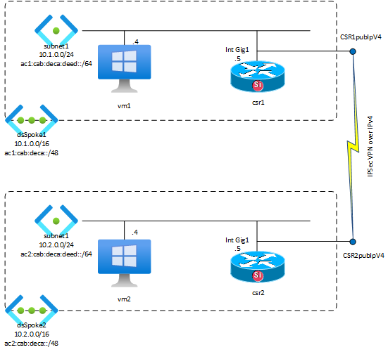

# **IPv6 over an IPv4 IPSec VPN with Network Virtual Appliances**

Although Azure VNET supports IPv4/IPv6 dual stack networking, the Site-to-site 
VPN VNET Gateway does not. 

A VPN Gateway can be deployed in a dual stack VNET but will only enable IPv4 over VPN. The public (or private, in the case of VPN over ExpressRoute) tunnel endpoint addesses can also only be IPv4. IPv6 over VPN is in development at the time of this writing in May 2024, but an availability date has not been announced.

Router- and Firewall Network Virtual Appliances from various vendors do support IPv6 VPN, and can be used as an alternative to the Azure-native VNET Gateway.

This lab demonstrates an IPv6 VPN solution between two Cisco Catalyst 8000v routers.

# Deployment

Log in to Azure Cloud Shell at https://shell.azure.com/ and select Bash.

Create an empty Resource Group:

    az group create --name <rg-name> --location swedencentral
Clone the repo to Cloud Shell or a local machine with az cli installed:

    git clone https://github.com/mddazure/ipv6-over-vpn-nva

Change directory: 

    cd ipv6-over-vpn-nva/templates

Accept license terms for the Cisco 8000v Network Virtual Appliance:

    az vm image terms accept --urn cisco:cisco-c8000v-byol:17_13_01a-byol:latest

Deploy the lab:

    az deployment group create -n ipv6nva -g <rg-name> --template-file main.bicep

This deploys the components shown in the diagram above.

# Configuration

After deployment completes the routers must be configured.

Use Serial Console in the portal, under the Help sub menu in the VM blade, to connect to the console of each of the routers.

Credentials:
- Username: AzureAdmin
- Password: ipV6demo-2024

At the prompt, type

    en

followed by

    conf t

Copy this line into the console:

    license boot level network-advantage addon dna-advantage

Type 

    do wr mem

and then

    do reload

This process activates the crypto feature set and reboots the router.

:point_right: Now insert the Public IP addresses of c8k1 and c8k2 into the ios configuration files as follows:

- Copy the files c8kspoke1.ios and c8kspoke2.ios to a text editor.

- In the portal, look up the public ip addresses of c8k1 and c8k2.

- In the text files, replace the placeholder c8k1-pubIPv4 by the public ip of c8k1, and replace c8k2-pubIPv4 by the public ip of c8k2.

When reboot has completed, log on to each router again.

At the prompt, type

    en

followed by

    conf t

Copy and paste the modified configuration files into the respective routers.

Type

    end

You should see messages in each router that Tunnel101 and Tunnel0 are up.

Store the configuration by typing

    copy run start

Confirm the file name `start-up config`.

This configuration creates an IPv4 IKEv2/IPSec VPN tunnel between the two routers, over their IPv4 public endpoints. This tunnel is represented by `interface Tunnel101` on both routers.
An IPv6-in-IPv4 tunnel over the IPSec tunnel enables the transportation of IPv6. This is represented by `interface Tunnel0`.

# Routing

Static routes for the remote VNET's IPv4 and IPv6 address space point to interfaces `Tunnel101` and `Tunnel0` respectively.

User Defined Routes on the subnets in both VNETs direct traffic for the remote VNET's IPv4 and IPv6 address space to the local router's LAN interface. 

Dynamic routing leveraging Azure Route Server is not possible, as ARS does not support IPv6.  

# Testing
Connect to vm1 from bastion1:
- IP address: 10.1.0.4
- Username: AzureAdmin
- Password: ipV6demo-2024

Open a command prompt and access vm2's web server over IPv4 and IPv6:
    
    curl 10.2.0.4

    curl [ac2:cab:deca:deed::4]:80

The response will be `vm2`.

This proves that both IPv4 and IPv6 connectivity exists between the VNETs over VPN.

